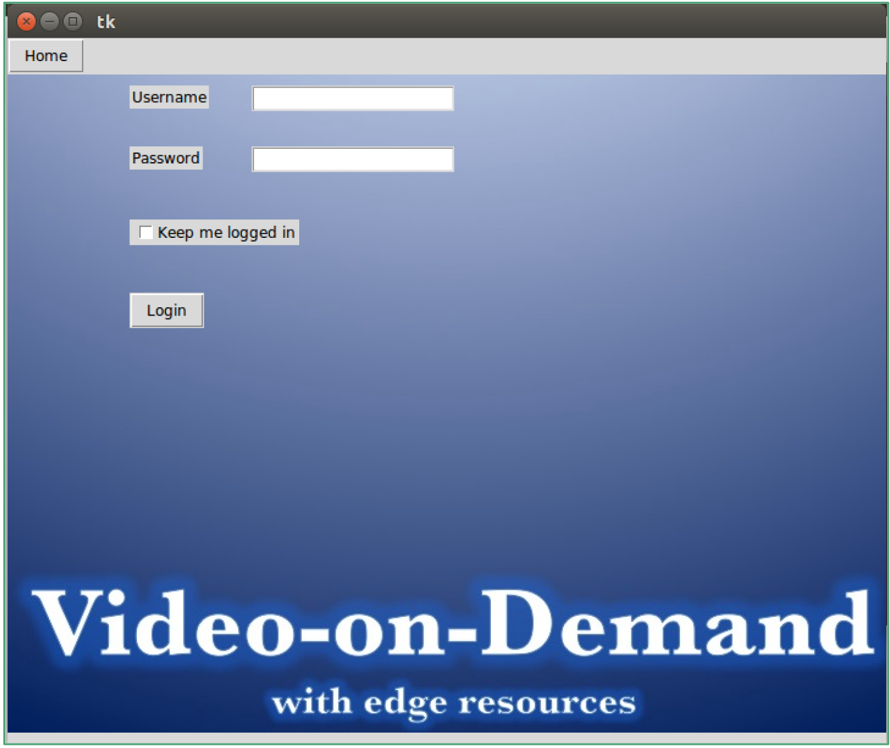
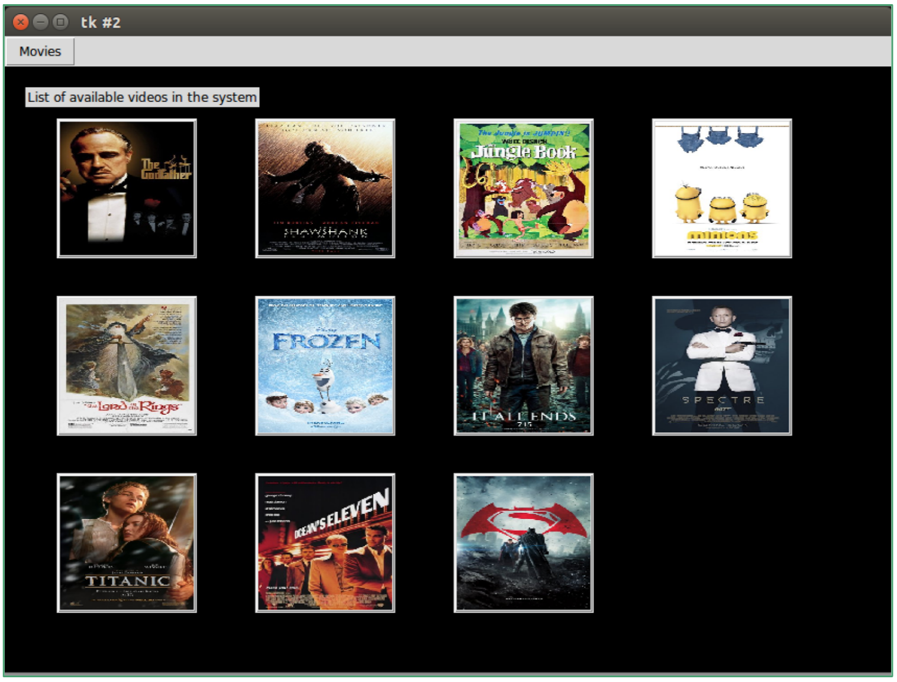
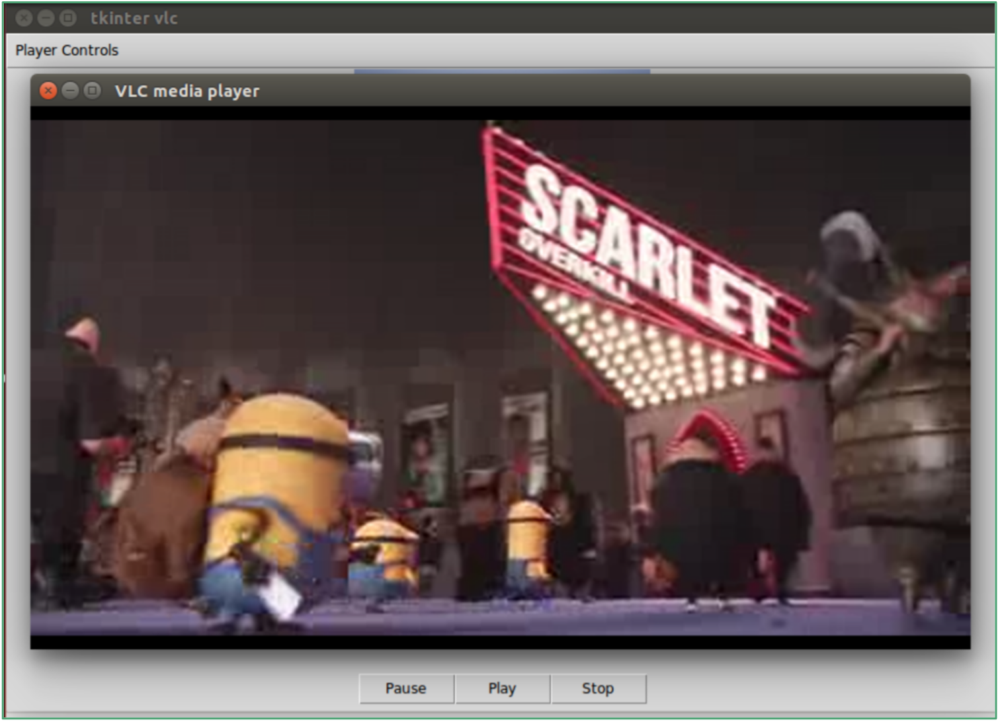
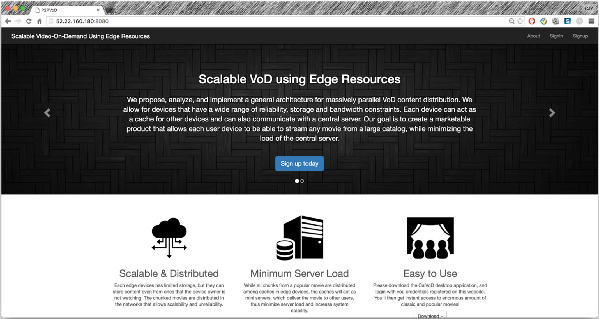
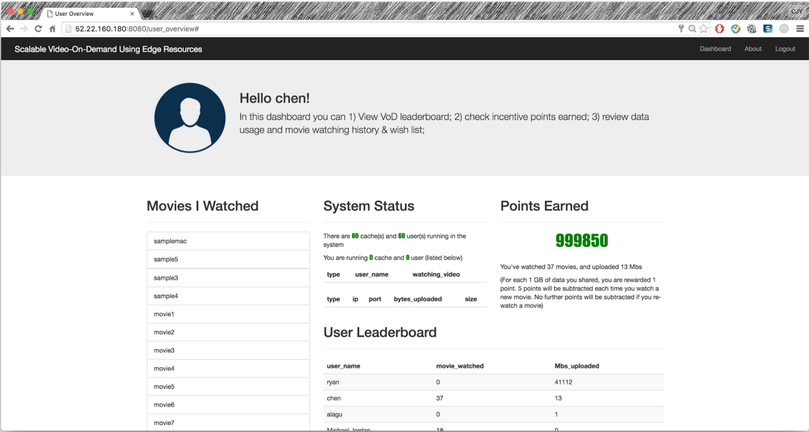
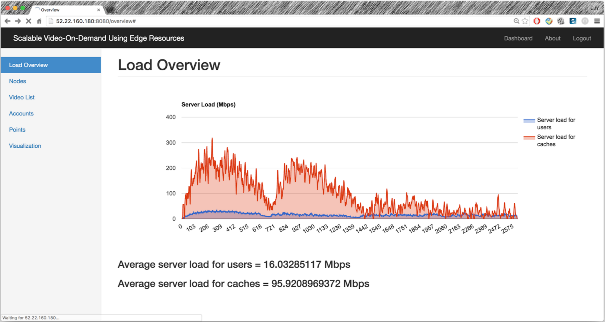
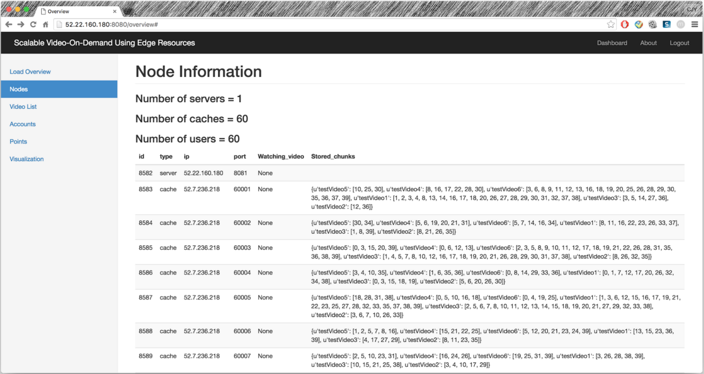
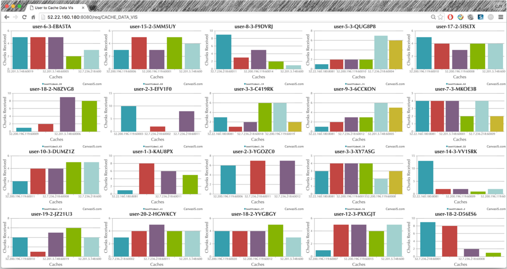

CalVoD
======

CalVoD is an open-source implementation of a distributed architecture for Video-on-Demand content distribution system, proposed in [1]. In this system, each user runs a distributed caching/streaming algorithm, which in turn results in the minimal streaming load on the central server. Our extensive experiments (in [1]) prove practical efficiency of the proposed system and demonstrate remarkable robustness to system scale and changes in demand, user churn, network failure and node failures. 

How to use
======
Installation Guide on a new machine: [Installation Guide](https://github.com/kw1jjang/CalVoD/wiki/Installation-Guide)

Run the CalVoD system (locally & publicly): [run CalVoD system](https://github.com/kw1jjang/CalVoD/wiki/run-CalVoD-system)

Using AWS for large scale test: [Running scale up test on AWS](https://github.com/kw1jjang/CalVoD/wiki/Running-scale-up-test-on-AWS)

Current open issues for future improvements: [Issues](https://github.com/kw1jjang/CalVoD/issues)

Please checkout the Wiki page for more information!

Screenshots
======

Contributors
======
The original version of the system is written by Kangwook Lee, and the current release is written/improved by Jiayuan Chen, Alagu Santana Haribhiskaran, Ryan Kashi, as part of the capstone project for their master degrees. Corresponding capstone reports are listed here: [Jiayuan](https://www2.eecs.berkeley.edu/Pubs/TechRpts/2016/EECS-2016-42.html) [Alagu](https://www2.eecs.berkeley.edu/Pubs/TechRpts/2016/EECS-2016-96.html) [Ryan](https://www2.eecs.berkeley.edu/Pubs/TechRpts/2016/EECS-2016-84.html)

Google Drive of the capstone project: [CalVoD_Project_Folder](https://drive.google.com/drive/u/1/folders/0B539-s6-LK--bUhkdXlCT1FNQkU) 

Related publications
======
[1] K. Lee, L. Yan, A. Parkeh and K. Ramchandran, “A VoD System for Massively Scaled, Heterogeneous Environments: Design and Implementation”, IEEE 21st International Symposium on Modeling, Analysis and Simulation of Computer and Telecommunication Systems (MASCOTS 2013), San Francisco, CA, August, 2013. Best Paper Finalist.

[2] K. Lee, H. Zhang, Z. Shao, M. Chen, A. Parekh and K. Ramchandran, “An Optimized Distributed Video-on-Demand Streaming System: Theory and Design”*, The 50th Allerton Conference on Communication, Control and Computing, Monticello, IL, October, 2012. (invited paper)

[3] S. Pawar, S. Rouayheb, H. Zhang. K. Lee and K. Ramchandran, “Codes for a Distributed Caching based Video-On-Demand System”, Asilomar Conference on Signals, Systems, and Computers, Pacific grove, CA, November, 2011.

[4] Hao Zhang, Ziyu Shao, Minghua Chen, and Kannan Ramchandran, “Optimal Neighbor Selection in BitTorrent-like Peer-to-Peer Networks”, in Proceedings of ACM SIGMETRICS, San Jose, CA, US, June 7-11, 2011. (poster paper)

[5] Hao Zhang, Minghua Chen and Kannan Ramchandran, “Scaling P2P Content Delivery Systems Reliably by Exploiting Unreliable System Resources,” IEEE MMTC E-Letter of December, 2009. (invited paper)

[6] Hao Zhang, Jiajun Wang, Minghua Chen and Kannan Ramchandran, “Scaling Peer-to-Peer Video-on-Demand Systems Using Helpers,” IEEE International Conference on Image Processing (ICIP), Nov, 2009.

[7] Hao Zhang and Kannan Ramchandran, “A Reliable Decentralized Peer-to- Peer Video-on-Demand System Using Helpers,” Picture Coding Symposium (PCS), May, 2009. (invited paper)
